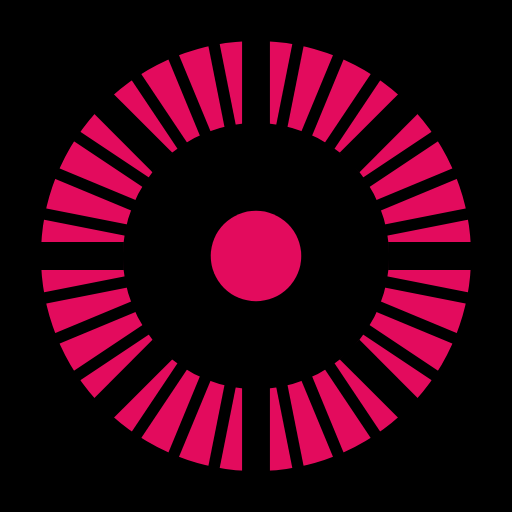

# Showdist

<p align="center"></p>

An augmented-reality tape measure for Android, built with Flutter and ARCore.
Point the camera at a surface, tap to drop points, and read off the distances.
Measurements can be saved on the device, browsed in a history, and shared as
a plain-text file through the Android share sheet, or copied as text.

The look is a vivid pink (`#E30B5D`) on black in Dark, and a medium grey with
a darker, muted version of the same pink in Light: hairline measuring lines,
small dots for points and the reticle, and a background of drifting tick
marks. It is an independent project and is not affiliated with Google or
Android.

## Using it

The app opens straight to a **main menu**: just the words **MEASUREMENT**
and **LEVEL** over a background of drifting ruler tick marks, the Showdist
wordmark at the bottom, and Settings one tap away, top right. No icons, no
containers around either.

**Measuring.** This screen's colors are fixed (the same in Light and Dark) —
it's the live camera feed, not the app's own chrome, so it has no reason to
follow the system theme.

1. Allow camera access. If the phone lacks Google Play Services for AR, the app
   offers to install it.
2. Move the phone slowly so ARCore can find surfaces. The four dots around
   the screen centre light up when they are on a surface.
3. **Tap** the large button to place a point. Each new point adds a
   segment with its length, and a dashed line shows the live distance from the
   last point to the reticle.
4. **Hold anywhere on screen** once you have two or more points to stop and
   save the measurement — not just the button, so you don't have to aim for
   it. The button's ring fills as you hold, wherever your thumb actually is.
   The screen clears, ready for the next one.

The bottom row, left to right:

| Control | Action |
| --- | --- |
| History | Open the history of saved measurements (count badge) |
| Undo | Remove the last point |
| Button, tap | Place a point at the reticle |
| Hold anywhere on screen (0.8 s) | Save the measurement and start fresh |
| Close | Clear all points without saving |
| M / FT | Metric or imperial display |

Up to 24 points per measurement. Portrait only. The system back gesture/button
returns to the main menu.

**Level.** A bubble level for things mounted on a wall — a shelf, a picture
frame, a TV bracket — using the accelerometer. Hold the phone upright and flat
against the wall (or against whatever you're checking). The dot centres
in the ring and the ring lights up when you're within 0.3° of plumb; the
readout below is the tilt in degrees.

## Settings

Reached from the gear icon on the main menu. Both choices are saved on device
and restored on the next launch:

- **Theme** — System (default), Light, or Dark. Dark is black with the brand
  pink as its accent; Light is a medium grey (`#9E9E9E`) with a darker-grey
  bar and card and a deep, muted version of the same pink as its accent —
  Neon itself doesn't have enough contrast against a mid-grey background to
  use as text.
- **Units** — Imperial (default: feet and inches, e.g. `4′ 7 1/2″`) or
  Metric. The same setting drives the in-AR M/FT toggle.

**About**, one tap further in, shows the app name, version, and a licenses
page (Flutter, ARCore, and the bundled JetBrains Mono font).

## Saving and exporting

Saved measurements are stored on the device (`recordings.json` in the app's
private storage) and survive restarts. If that file is ever unreadable it is
renamed to `recordings.json.corrupt` rather than overwritten.

### History

The history button opens every saved measurement, newest first. Scroll down to
go further back; each row shows the total, the point count, and a small
sketch of its shape — no date. The back arrow returns to measuring.

- **Tap** a row to see every segment and share or copy it.
- **Long-press** a row, or choose **Select** from the menu, to select several.
  Tap rows to add or remove them, or use **Select all**. The bin deletes the
  selection. Back cancels selection first.
- **Delete all** is in the menu. Every delete asks for confirmation first.

### Sharing and copying

Each measurement has two actions, in the save sheet, the detail sheet, and the
share menu on each history row:

- **Share .txt** writes a plain-text file and hands it to the Android share
  sheet — the standard system picker of whatever's installed (Drive, email,
  chat, notes, anything that accepts a file). The share also carries the same
  text directly, for apps that show only the message and drop the attachment.
- **Copy text** puts that same plain-text summary on the clipboard.

Both produce the same text — the total and every segment, no date or
timestamp:

```
Showdist: 17.00 m
3 points, 2 segments
1. 5.00 m
2. 12.00 m
```

Recordings longer than 20 segments are truncated in the text, with a note
pointing at the attached file for the rest.

Measurements are still ordered newest-first in the app and recorded with an
internal timestamp for storage, but that timestamp isn't shown anywhere or
included in what's shared — only the shared `.txt` file's name carries one
(e.g. `showdist-20260921-164005.txt`), so repeated exports don't overwrite
each other.

## Requirements

- An Android device that supports [ARCore](https://developers.google.com/ar/devices),
  running Android 7.0 (API 24) or newer.
- To build: Flutter (developed on 3.47.5 stable, Dart 3.13.4), JDK 17 or newer,
  and the Android SDK with platform 36.

## Build and run

```sh
flutter pub get
flutter devices                 # find your phone (USB debugging enabled)
flutter run -d <device-id>      # debug build
flutter build apk --release     # release APK
```

The release build is signed with the debug key (see `android/app/build.gradle.kts`),
which is fine for installing on your own devices. Set up a real signing config
before distributing it.

Tests and analysis:

```sh
flutter analyze
flutter test
```

The launcher icon (adaptive, with a themed monochrome layer, plus legacy icons
and `docs/logo.png`) is rendered from the same painter as the About screen's
badge. After changing `lib/common/tick_ring_painter.dart`, regenerate it with:

```sh
flutter test tool/generate_icons.dart
```

## How it works

ARCore runs natively in Kotlin. Flutter draws every pixel of UI. They talk over
one method channel and one event channel.

```
Kotlin (android/app/src/main/kotlin/com/showconfigs/showdist/)
  ArMeasureController   owns the ARCore Session, permissions and install flow,
                        and the channels ar_measure/ar and ar_measure/frames
  ArMeasureView         GLSurfaceView platform view: draws the camera feed,
                        hit-tests the screen centre each frame, keeps the anchors
  BackgroundRenderer    camera image as a full-screen OpenGL quad

Dart (lib/)
  menu/                 the main menu (Measurement / Level / Settings)
  measure/              AR screen, constellation painter, units, recordings,
                        storage, sharing, the history screen and detail sheet,
                        and the Settings screen
  level/                the accelerometer-driven bubble level
  common/               the tick-ring painter, the wordmark painter, Caption
tool/generate_icons.dart  renders the launcher icon from the in-app tick ring
```

Each camera frame the native side sends one flat `DoubleArray`. Anchor
positions are projected to screen coordinates natively, so Dart never needs the
camera matrices:

| Index | Meaning |
| --- | --- |
| 0 | Tracking: 0 stopped, 1 tracking, 2 lost |
| 1 | Failure reason: none, bad state, too dark, too fast, few features, camera unavailable |
| 2 | Number of tracked planes |
| 3 | 1 if the screen centre hits a surface |
| 4 to 6 | Reticle hit, world x y z (metres) |
| 7 to 8 | Reticle hit, screen x y (0 to 1, top-left origin) |
| 9 | Number of anchors, then per anchor: world x y z, screen x y, visible |

The layout is documented in `ArMeasureView.kt` and decoded by `ArFrame.parse`.
Hit tests accept a plane (inside its polygon), a depth point, or an oriented
feature point. Depth is enabled automatically on devices that support it, which
improves accuracy on walls and objects.

The camera view is hosted with hybrid composition so the Flutter overlay can
draw above it.

## Testing

`flutter test` runs 55 tests:

- unit formatting (metric and imperial)
- decoding the native frame payload, including truncated payloads
- segment and total maths, the plain-text summary (and its truncation past
  20 segments), and the folder exports are written to
- the recording store: persistence, ordering, removing some or all, change
  notifications, and a corrupt save file
- the history thumbnails (how a 3D measurement is flattened)
- the history screen: newest-first order, the empty state, back, selection,
  select all, delete with confirmation (and cancelling), delete all, system back
  leaving selection first, opening a row, and Copy text reaching the clipboard
- the measuring overlay: a distance label is drawn only when its segment's
  midpoint is on-screen, so no labels are stranded on the edges
- the main menu: both tiles are present, Level opens the bubble level, the
  gear opens Settings

The native ARCore path (session start, hit testing, anchors, projection) and
the Level screen's accelerometer reading have no automated tests, because
both need real hardware. Test them on a device.

## Known limitations

- **Emulator.** The Android emulator's virtual-scene camera did not work in
  testing: ARCore session creation failed on an API 36 x86_64 image, with
  ARCore reporting no default camera 0. Use a physical device.
- Accuracy depends on the device and on the surface. Expect roughly a
  centimetre or two in good conditions; plain, featureless, or shiny surfaces and
  low light are worse.
- Android only, portrait only.

## Dependency notes

- `permission_handler` is pinned to `^12.0.1`. Version 13 and later require
  `compileSdk` 37, which the Gradle and AGP setup here could not resolve.
- `share_plus` is pinned to `^11.0.0`. Version 13 moves to `jni` native-asset
  build hooks, which is a heavier toolchain than a share sheet needs.
- `shared_preferences` stores the Settings screen's theme and units choices.
- `sensors_plus` reads the accelerometer for the Level screen.

## Design

Colours live in `lib/theme.dart` as `Palette`, a `ThemeExtension` reached with
`Palette.of(context)`, plus the raw hues in `Hue`:

| | Neon `#E30B5D` | Bright `#F64689` | Burnt `#9C0840` | Deep `#610528` | Ink `#111111` | Black `#000000` |
| --- | --- | --- | --- | --- | --- | --- |

Neon is the exact brand color; Bright/Burnt/Deep are lighter/darker shades of
the same hue and saturation.

- **Dark** (default under System, on an OLED-friendly black): background and
  bars are Black, text is white, the active/accent colour is Neon.
- **Light**: a medium grey base (`#9E9E9E`), with a darker grey bar and card
  (`#616161` / `#757575`, both taking white text) and Deep — a dark, muted
  version of the brand pink — as the accent. A mid-grey background is close
  to the worst case for contrast against both black and white text, so
  Light's numbers have much less headroom than Dark's, and `emphasis` (Deep)
  only clears 3:1 there — enough for icons and graphics, not for body text,
  so nothing in the app sets it as a text colour in Light (the Level screen's
  readout, for one, stays `onBase` even when "level" — the ring lighting up
  is the signal).
- **Camera overlay** (`ConstellationPainter`): lines, the four reticle dots,
  and distance labels are always Neon with a small dark drop shadow,
  regardless of theme — it sits on the live camera feed, not the app's own
  chrome. The reticle's centre dot is white, so it stays visible against the
  dots around it. The whole Measurement screen's chrome, in fact, is fixed
  to the Dark palette regardless of the Light/Dark setting, for the same
  reason: it's real-world imagery, not app chrome, so it has no theme to follow.

Every text/background combination the app actually uses was checked against
WCAG's 4.5:1: in Dark, white on Black (21:1); in Light, `#262626` on the
background (5.7:1), white on the bar (6.2:1), and white on the card (4.6:1).
Neon (the brand pink) on Black comes out to 4.47:1 — a hair under the formal
line — which is used as-is for the two small dark-theme text spots that set
it (the unit toggle's "on" label, the history badge count); everywhere else
it's decorative (icons, graphics, the camera overlay), which only needs 3:1.
Secondary/"muted" text is a second solid colour, not the primary colour at
reduced opacity, so dimming it can't quietly drop it below the ratio a screen
was checked at — though on Light's bar/card, white already has so little
headroom that "muted" there is just white again; de-emphasis comes from size
and weight only.

Text is set in **JetBrains Mono** (bundled under `assets/fonts/`, OFL-1.1
licensed — see `assets/fonts/JetBrainsMono/OFL.txt`), the only font in the
app. Its zero is dotted by default; the app turns on the `zero` OpenType
feature (`FontFeature.slashedZero()`) everywhere so 0/O and 1/l/I stay
unmistakable.

Small filled circles — not diamonds — mark measuring points, the reticle, the
main button, and the level's bubble. The **app icon** (and the About screen's
badge, `lib/common/tick_ring_painter.dart`) has no lettering at all: a black
field, a Neon ring, and black tick marks notched across it at regular
intervals, like a gauge dial.
The **Showdist wordmark** ("SHOW" over "DIST", `lib/common/wordmark_painter.dart`)
appears bare — no background, coloured from the theme — at the bottom of the
main menu, whose background is otherwise a large, continuously drifting ruler
edge: a baseline with tick marks hanging from it, like a tape measure, in the
accent colour. Both painters size themselves to fit whichever context they're
rendered into.

## License

[MIT](LICENSE)
